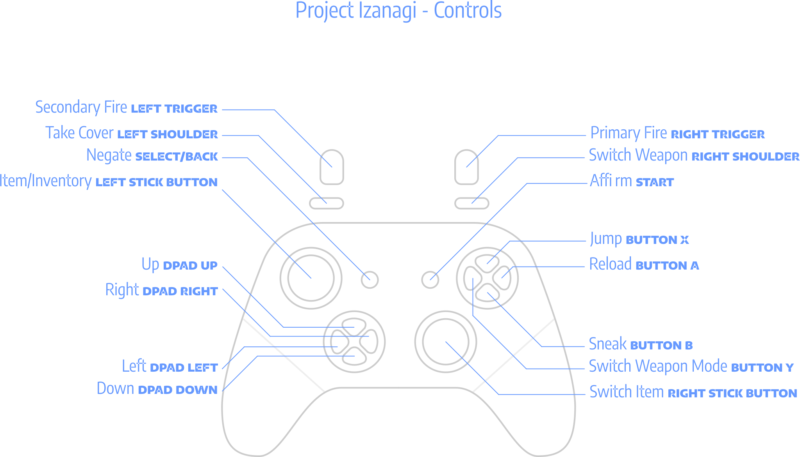

# Controls

| Action  | Default Gamepad Control                       | Effect                            | Remarks                                                                                                |
|---------|-----------------------------------------------|-----------------------------------|--------------------------------------------------------------------------------------------------------|
| Up      | DPad Up/Left Stick Up/Right Stick Up          | Select Menu Item Up/Look Up       |                                                                                                        |
| Right   | DPad Right/Left Stick Right/Right Stick Right | Select Menu Item Right/Move Right |                                                                                                        |
| Down    | DPad Down/Left Stick Down/Right Stick Down    | Select Menu Item Down/Crouch      |                                                                                                        |
| Left    | DPad Left/Left Stick Left/Right Stick Left    | Select Menu Item Left/Move Left   |                                                                                                        |
| Affirm  | Start                                         | Confirm Selected Option           |                                                                                                        |
| Negate  | Select (Back)                                 | Go Back                           |                                                                                                        |
| Action0 | North Button (Button X)                       | Jump                              | When crouched, player will go down a solid-on-top ground.                                              |
| Action1 | Right Trigger                                 | Primary Fire                      | Each weapon has firing characteristics, see below.                                                     |
| Action2 | Left Trigger                                  | Secondary Fire                    | Each weapon has firing characteristics, see below.                                                     |
| Action3 | East Button (Button A)                        | Reload                            | Reload always drops current clip regardless if there are rounds left.                                  |
| Action4 | West Button (Button Y)                        | Switch Weapon Mode                | Press to select next weapon mode (cycle), hold then press Left/Right to set previous/next weapon mode. |
| Action5 | Right Bumper (Shoulder)                       | Switch Weapon                     | Press to select next weapon (cycle), hold then press Left/Right to set previous/next weapon.           |
| Action6 | Left Stick Button                             | Item/Inventory                    | Hold to open inventory, double press to use current item.                                              |
| Action7 | Right Stick Button                            | Switch Item                       | Press to select next item (cycle), hold then press Left/Right to set previous/next item.               |
| Action8 | Left Bumper (Shoulder)                        | Take Cover                        | Enter doors, go between objects to hide from enemies.                                                  |
| Action9 | South Button (Button B)                       | Sneak                             | Hold then press Left/Right to sneak. (do we need this control, or crouch is enough?)                   |

# Control Internals

| Control                 | Config Key             |
|-------------------------|------------------------|
| DPad Left               | `button:dpleft`        |
| DPad Right              | `button:dpright`       |
| DPad Up                 | `button:dpup`          |
| DPad Down               | `button:dpdown`        |
| Start                   | `button:start`         |
| Select (Back)           | `button:back`          |
| East Button (Button A)  | `button:a`             |
| South Button (Button B) | `button:b`             |
| North Button (Button X) | `button:x`             |
| West Button (Button Y)  | `button:y`             |
| Left Bumper (Shoulder)  | `button:leftshoulder`  |
| Right Bumper (Shoulder) | `button:rightshoulder` |
| Left Stick Button       | `button:leftstick`     |
| Right Stick Button      | `button:rightstick`    |
| Left Trigger            | `axis:+lefttrigger`    |
| Right Trigger           | `axis:+righttrigger`   |
| Left Stick Left         | `axis:-leftx`          |
| Left Stick Right        | `axis:+leftx`          |
| Left Stick Up           | `axis:-lefty`          |
| Left Stick Down         | `axis:+lefty`          |
| Right Stick Left        | `axis:-rightx`         |
| Right Stick Right       | `axis:+rightx`         |
| Right Stick Up          | `axis:-righty`         |
| Right Stick Down        | `axis:+righty`         |

> **Note:** The config keys are based from SDL internal names, only we have added the `button:` and `axis:` bind
> prefixes to be flexible on setting up controls on the gamepad. The reason is gamepad controls use different
> types of binds.
