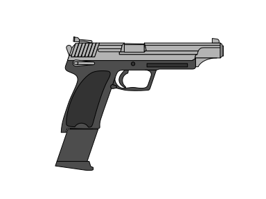
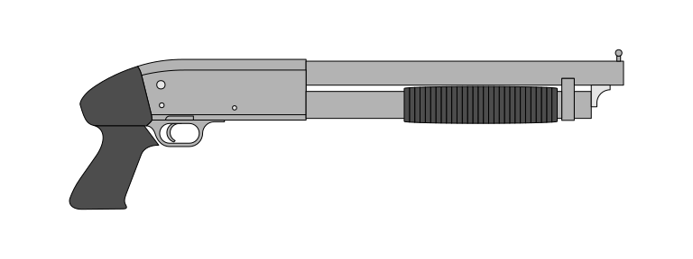

# Inventory

| Class           | Model                               | Codename `*`    | Origin        | Ammo                          | Rounds (per unit) | Maximum reserves | Cyclic rate of fire (rounds/min) | Muzzle velocity (m/s) |                               Unit length (mm) | Unit width (mm) | Unit height (mm) | Remarks                                                 |
|-----------------|-------------------------------------|-----------------|---------------|-------------------------------|------------------:|-----------------:|---------------------------------:|----------------------:|-----------------------------------------------:|----------------:|-----------------:|---------------------------------------------------------|
| Combat knife    | Combat knife                        | `**`            | Switzerland   | -                             |                 - |                - |                                - |                     - |                                              - |               - |                - | -                                                       |
| Pistol          | Beretta 92FS                        | Servant         | Italy         | 9x19mm Parabellum             |                15 |                4 |                                - |                   381 |                                            217 |              38 |              137 | Can be dual-wielded                                     |
| Pistol          | Magnum Research Desert Eagle MK XIX | Hitman          | United States | .50 Action Express            |                 7 |                3 |                                - |                   470 |                                          273.1 |               - |                - | Uses 20-round extended magazine (from normal 12 rounds) |
| Pistol          | H&K USP Elite .45                   | Ordinator       | Germany       | .45 ACP                       |                20 |                4 |                                - |                   350 |                                            239 |              29 |              151 | -                                                       |
| Pistol          | Walther PP                          | -               | Germany       | 9x18mm Ultra                  |                 7 |                - |                                - |                   320 |                                            170 |              98 |              109 | -                                                       |
| Sub-machine gun | H&K MP5A5                           | Operator        | West Germany  | 9x19mm Parabellum             |                30 |                4 |                              800 |                   400 | 680 (stock extended), 504.22 (stock collapsed) |              50 |              260 | -                                                       |
| Sub-machine gun | H&K MP5KA1                          | Tactician       | West Germany  | 9x19mm Parabellum             |                30 |                4 |                              900 |                   375 |                                            325 |               - |                - | -                                                       |
| Sub-machine gun | H&K MP7A1                           | Specialist      | Germany       | HK 4.6x30mm                   |                40 |                3 |                              950 |                   735 |    638 (stock extended), 415 (stock collapsed) |              51 |            169.5 | -                                                       |
| Sub-machine gun | H&K UMP45                           | -               | Germany       | .45 ACP                       |                25 |                - |                              600 |                   285 |       690 (stock extended), 450 (stock folded) |               - |                - | -                                                       |
| Sub-machine gun | UZI                                 | -               | Israel        | .45 ACP                       |                16 |                - |                              600 |                   400 |    640 (stock extended), 470 (stock collapsed) |               - |                - | -                                                       |
| Shotgun         | Ithaca Model 37                     | Impressor       | United States | 12-gauge buckshot size F      |                 7 |               21 |                                - |                   410 |                                            760 |               - |                - | -                                                       |
| Assault rifle   | Kalashnikov AK type 3               | Militant        | Soviet Union  | 7.62x39mm                     |                30 |                3 |                              600 |                   715 |                       880 (fixed wooden stock) |               - |                - | -                                                       |
| Assault rifle   | Colt M4A1 + M203 Grenade Launcher   | Paragon         | United States | 5.56x45mm NATO / 40mm grenade |                30 |            3 / 5 |                              800 |                   910 |    838 (stock extended), 756 (stock retracted) |               - |                - | -                                                       |

`*` Codenames are for usable weapons only and can be equipped by both players and enemies. Unusable weapons are only equipped by enemies.

`**` Despite not having a dedicated weapon slot, the combat knife's codename is "Guerrilla".

# Trivia

- Servant is the only weapon to be dual-wielded. Also, it is the only weapon that the player does not use the knife when doing melee attacks because the player already has both hands holding the guns when they are dual-wielded.
- Hitman is the most powerful pistol, equating Impressor for power, but rarer to get.
- Ordinator normally has 12 rounds, but ammo crates and drops have extended magazines of 20 rounds, making it the most number of rounds of any pistol.
- Operative and Tactician are basically the same (MP5A5 and MP5KA1 respectively), but the former packing more power and a faster muzzle velocity yet has a slower rate of fire, while the latter has less power and slower muzzle velocity but faster rate of fire. When the player acquires both guns, their magazines can be interchangeable.
- Specialist can have scope attachments that can increase the firing range of the player. It also has the fastest rate of fire among automatic guns.
- Impressor is the only shotgun in the game.
- Militant is more likely to appear in map crates.
- Paragon is the only gun in the game with a grenade launcher.
- Enemies equipped with the Servant do not wield them dually.

# Usage

| Codename   | Primary Fire | Secondary Fire                                           | Modes                                    | Frequency (%) |
|------------|--------------|----------------------------------------------------------|------------------------------------------|--------------:|
| Servant    | Single fire  | Double fire (dual-wielded), single fire (single-wielded) | Single wield, dual wield                 |            15 |
| Hitman     | Single fire  | Single fire                                              | Single wield                             |             8 |
| Ordinator  | Single fire  | Single fire                                              | Single wield                             |            12 |
| Operator   | Modal fire   | Modal fire                                               | Single fire, burst fire, continuous fire |            12 |
| Tactician  | Modal fire   | Modal fire                                               | Single fire, burst fire, continuous fire |            10 |
| Specialist | Modal fire   | Modal fire                                               | Single fire, continuous fire             |             8 |
| Impressor  | Single fire  | Single fire                                              | Single fire                              |             7 |
| Militant   | Modal fire   | Modal fire                                               | Single fire, continuous fire             |            12 |
| Paragon    | Modal fire   | Launch grenade                                           | Single fire, burst fire                  |             9 |

# Sprites

> 
>
> Servant

> 
>
> Hitman

> 
>
> Ordinator

> 
>
> Operator

> 
>
> Tactician

> 
>
> Specialist

> 
>
> Impressor

> 
>
> Militant

> 
>
> Paragon
